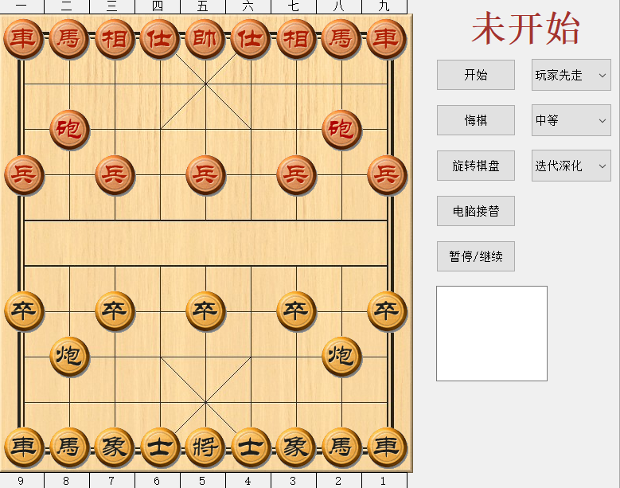

中国象棋人机对战版本
====================

本程序为纯cpp编写，使用QT5.13.2在win10下完成，代码极其朴素，适合C++新手学习。  
**图片素材来源于象棋巫师，代码主要参考《PC游戏编程（人机博弈） 》以及象棋百科全书网站。**  

程序的基本思想是博弈树，利用负极大值算法（极大极小值算法改进形式），并对其进行优化。  

**具体优化及功能如下：**  

1.棋盘采用16*16（256）的一维数组，加快计算速度，布局使用FEN串（其实就是棋子位置的一种简化表示）。  

2.实现了置换表、历史启发、迭代深化等技术。  

3.将军检测，绝杀检测。  

4.解决了长将、长捉问题，电脑会避免长将长捉。  

5.尝试用宁静搜索克服水平线效应，结果并不很理想。  

6.可人人对战、人机对战、机器互博，以及让机器接替人走棋。

7.棋局记录，为简化程序，没有涉及数据库，关闭或重开后清空记录。  

8.可选难度（其实就是粗暴设定时间）。  

9.迭代深化选项包含了所有的优化（除宁静搜索），其可设定电脑计算时间，当到达设定时间后，立即停止计算，解决了固定搜索深度在开局和中局耗时过多，残局又计算过少的问题。

10.没有使用开局库，所以开局可能会走的比较差， 喜欢兑子。

**本程序棋力主要依赖于估值函数和搜索深度。**  
估值函数目前已经考虑了棋子价值，棋子攻击范围，棋子被攻击减分，连环马牵手兵加分等情况，但仍然不够好，但是如果估值函数太复杂会导致搜索深度下降。i5-8300H单线程单核计算，迭代深化下，设定10秒，开局和中局大约能搜索五六层，残局能达到8层。 

本程序仍然有很多可以优化的地方，例如加入开局库，使用走法生成表等。
